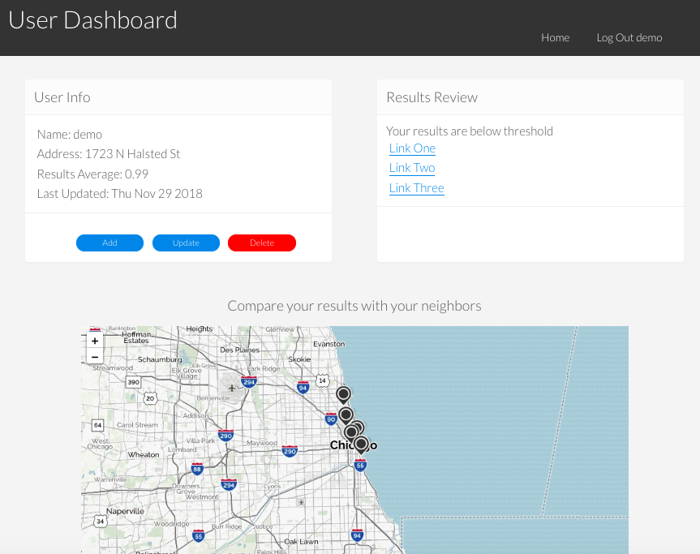

# community-water-node-capstone

## Project Description
This website provides the user with resources to learn about the health impacts of lead in water.  Additionally, it's a website for a user to access their local government's website to order a water testing kit.  After testing water they are able to create a login and enter their results.  The results will become part of a community database that shares resident information with the local government providing them with relevant data to take action in areas of concern.

### [*** Live Preview ***](https://community-water.herokuapp.com/)

## User Stories
* As a user I want to visit the website so that I can learn about the impact of lead in drinking water
* As a user I want to find a link to the city resource to order a water testing kit so that I can test my water
* As a user I want to create a user/login so that I can enter my water testing results
* As a user I want to enter my water test results so that my results go into a public data repository for community information
* As a user I want to see my results on a map with those of my neighborhood so that I can compare my results with nearby homes
* As a user I want to learn if my results exceed the EPA treatment limit so that I can learn the next steps of resolving this issue
* If my results exceed EPA treatment limits, as a user I want to answer additional questions so I can GET recommended solutions to my problem

## Screenshots

Home Page  | User Dashnboard
:-------------------------:|:-------------------------:
|

Signup Form | Login Form
:-------------------------:|:-------------------------:
|

Enter Results Form | Update Form
:-------------------------:|:-------------------------:
|

Delete Results | Map Screenshot
:-------------------------:|:-------------------------:
|

## Wire Frames

## Technical
* Front-End: HTML5 | CSS3 | JavaScript ES6 | jQuery
* Back-End: Node.js | Express.js | Mocha | Chai | RESTful API Endpoints | MongoDB | Mongoose

## Development Roadmap
This is v1.0 of the app, with basic RESTful features, but future enhancements are expected to include:
* Fully functional Map for comparing neighborhood results
* Map will provide markers color coded by results, and contain popup information

